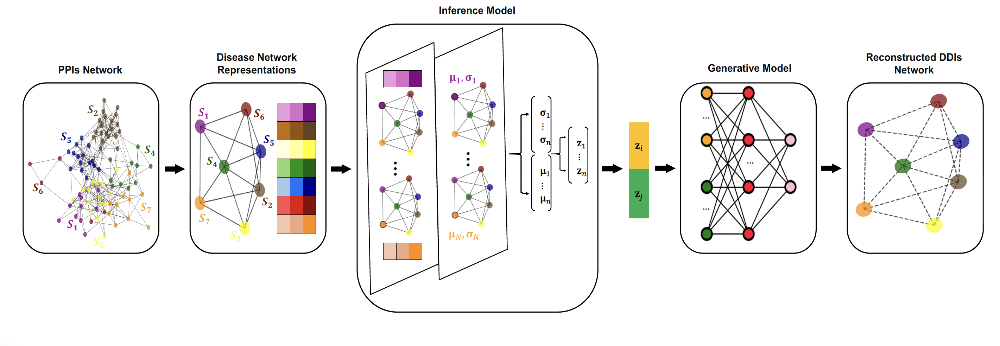

# SNN-VGA
Repository for ICCABS 2025 paper : Link Prediction in Disease-Disease Interactions Network Using a Hybrid Deep Learning Model

Authors: Ashwag Altayyar and Li Liao

## Overview
We introduce SNN-VGA, a novel hybrid deep learning framework that integrates Subgraph Neural Networks (SUBGNN) and Variational Graph Auto-Encoders (VGAE) for comorbidity prediction in the disease-disease interactions (DDIs) network. In this framework, disease modules are modeled as subgraphs within the Protein-Protein Interactions (PPIs) network. Subsequently, SUBGNN is adopted to generate embeddings for these subgraphs by capturing graph properties and considering multiple disconnected components. These embeddings are then passed to VGAE, which predicts links (i.e., comorbidities) between disease nodes based on their subgraph-level representations.
### The Hybrid Deep Learning Architecture of SNN-VGA 

## How to Use SNN-VGA
### Prerequisites
Conda must be installed on your system.
### Setup the Environment
Install the environment using the provided .yml file:
<pre lang="bash"> conda env create --file SNNVGA_environment.yml </pre>
### Prepare Data
Ensure that the following files are in your working directory:
  - Disease_features.csv: Feature vectors for each disease (generated by SUBGNN)
  - DDI_RR0_positive_edges.csv: Positive edges (disease pairs) with RR = 0
  - DDI_RR0_positive_labels.csv: Corresponding labels with with RR = 0
  - DDI_RR1_positive_edges.csv: Positive edges (disease pairs) with RR = 1
  - DDI_RR1_positive_labels.csv: Corresponding labels with RR = 1

### Train the Model
#### Determine the Relative Risk (RR) Threshold:
Set the RR threshold, either 0 or 1, which controls the positive sample criteria used in training.

#### Train the Model:
Use the determined threshold to train the model.
##### Run the model:
<pre lang="bash"> python train_SNNVGA.py RR_value </pre>
##### Example (for RR = 0):
<pre lang="bash"> python train_SNNVGA.py 0 </pre>

## Results

- The tables below show the performance of SNN-VGA compared with a state-of-the-art model (Weighted Geometric Embedding) on the comorbidity prediction task using RR thresholds of 0 and 1:
  ### Model Performance Comparison (RR = 0)
| Model                         | AUROC       | Accuracy    | Precision   | Recall      | F1          | AP          |
|------------------------------|-------------|-------------|-------------|-------------|-------------|-------------|
| **SNN-VGA**           | 0.96 ±0.01 | 0.92 ±0.01 | 0.91 ±0.01 | 0.94 ±0.01 | 0.92 ±0.01 | 0.95 ±0.00 |
| **Weighted Geometric Embedding** | 0.90        | 0.90        | 0.90        | 0.90        | 0.89        | -           |

  ### Model Performance Comparison (RR = 1)
| Model                         | AUROC       | Accuracy    | Precision   | Recall      | F1          | AP          |
|------------------------------|-------------|-------------|-------------|-------------|-------------|-------------|
| **SNN-VGA**           | 0.94 ±0.00 | 0.89 ±0.01 | 0.87 ±0.00 | 0.92 ±0.01 | 0.89 ±0.01 | 0.92 ±0.00 |
| **Weighted Geometric Embedding** | 0.76        | 0.70        | 0.70        | 0.70        | 0.69        | -           |

- The ROC (Receiver Operating Characteristic) curves are plotted for each fold of a 10-fold cross-validation, showing model performance for both RR = 0 and RR = 1.
  ### ROC Curve (RR = 0)
     

  ### ROC Curve (RR = 1)
     

